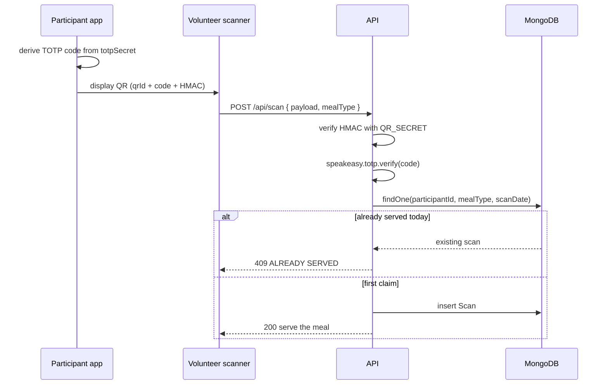
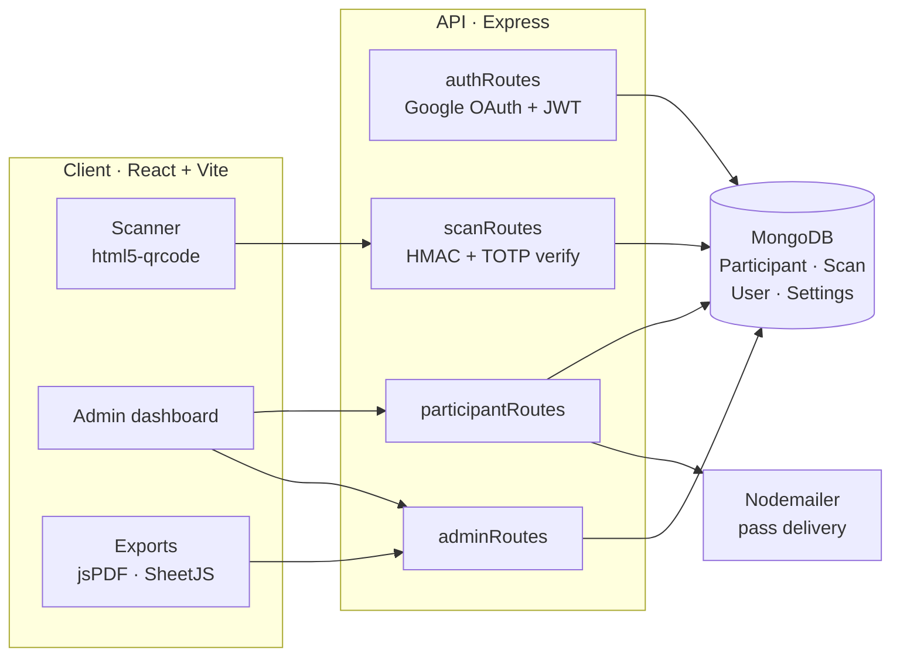

<p align="center">
  
  
  
  
  
</p>

<p align="center">
  <a href="https://mealpass-portal.vercel.app"></a>
</p>

## The problem

Feeding a few thousand people at a college fest usually means paper coupons. Coupons
get photocopied, passed to friends, counted by hand at midnight, and nobody knows how
much food is actually left until it runs out.

AAHAARAM replaces the coupon with a QR pass that **cannot be usefully screenshotted**,
and replaces the counting with a live dashboard.

## How a pass stays un-forgeable

A static QR code is just a picture — screenshot it, send it to ten friends, and ten
people eat. So the pass is not static.

Each participant is issued a TOTP secret at registration. The QR the volunteer scans
carries the participant's `qrId` plus a **rotating time-based code**, and the payload is
signed with an HMAC keyed on a server-side secret. Forging a pass requires the server
secret; reusing an old screenshot fails once the time window rolls over.



The duplicate check is a lookup on `(participantId, mealType, scanDate)` — so a person
gets one breakfast, one lunch and one dinner per day, and a second attempt is rejected
with the reason rather than a generic failure.

## Architecture



## What it does

| Capability | Detail |
| :-- | :-- |
| Rotating QR passes | TOTP code per participant, HMAC-signed payload |
| One meal per slot | Unique claim per `participant × mealType × date` |
| Volunteer scanning | In-browser camera scanning, no native app to install |
| Google sign-in | `@react-oauth/google` for staff, JWT sessions thereafter |
| Approval workflow | `isApproved` / `isActive` flags gate who can be served |
| Categories | Participant, department and custom metadata per person |
| Exports | Attendance to PDF (jsPDF) and Excel (SheetJS) |
| Email delivery | Passes sent out via Nodemailer |

## Running it locally

You need Node 18+ and a MongoDB connection string.

**API**

```bash
cd server && npm install && npm run dev
```

`server/.env`:

| Variable | Purpose |
| :-- | :-- |
| `MONGO_URI` | MongoDB connection string |
| `JWT_SECRET` | Signing key for session tokens |
| `QR_SECRET` | HMAC key for QR payloads — rotating this invalidates every issued pass |
| `EMAIL_USER` / `EMAIL_PASS` | Nodemailer credentials for sending passes |
| `CLIENT_URL` / `FRONTEND_URL` | Allowed origin for CORS and email links |
| `PORT` | Defaults to 5000 |

**Client**

```bash
cd client && npm install && npm run dev
```

`client/.env`:

| Variable | Purpose |
| :-- | :-- |
| `VITE_GOOGLE_CLIENT_ID` | Google OAuth client ID for staff sign-in |

> [!IMPORTANT]
> Camera access requires a secure context. `localhost` counts as secure, but if you test
> the scanner from a phone on your LAN you must serve it over HTTPS or the browser will
> refuse to open the camera.

## API surface

| Route | Purpose |
| :-- | :-- |
| `/api/auth` | Google OAuth exchange, JWT issue and refresh |
| `/api/participants` | Registration, approval, QR issue and lookup |
| `/api/scan` | Validate a pass and record the claim |
| `/api/admin` | Counts, attendance reports and export feeds |

## Screenshots

_Drop images into `docs/screenshots/` and reference them here — the scanner mid-scan and
the admin dashboard during service are the two worth showing._

## Licence

No licence file yet. Until one is added, default copyright applies and others cannot
legally reuse this code — add MIT if you want it to be usable.
